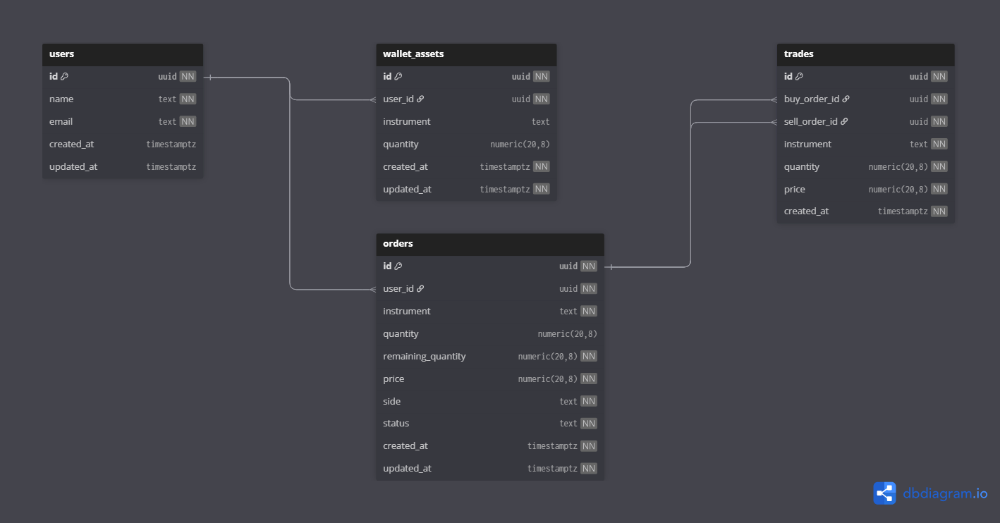
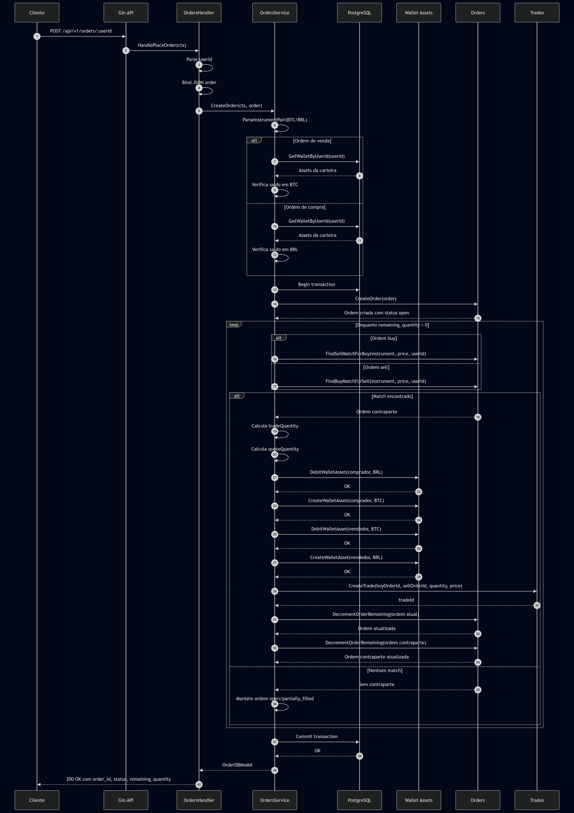
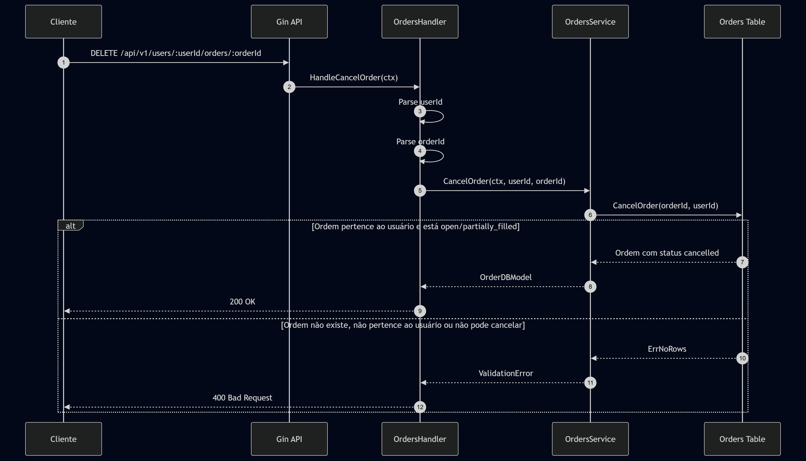

# Go Order Book

API REST em Go para simular um livro de ofertas (`order book`) com usuarios, carteiras, ordens de compra e venda, matching entre ordens, liquidacao de trades e cancelamento de ordens abertas.

O fluxo principal do projeto e:

1. Criar usuarios.
2. Creditar saldo nas carteiras.
3. Criar ordens de compra (`buy`) ou venda (`sell`).
4. Executar matching automaticamente quando existir contraparte compativel.
5. Consultar o livro de ofertas por instrumento.
6. Cancelar ordens abertas ou parcialmente executadas.

## Diagramas

### Banco de dados



### Sequencia de criacao e matching de ordem



### Sequencia de cancelamento de ordem



## Principais libs e ferramentas

| Nome | Uso no projeto | Link |
| --- | --- | --- |
| Gin | Framework HTTP, roteamento e middlewares da API REST. | [github.com/gin-gonic/gin](https://github.com/gin-gonic/gin) |
| go-playground/validator | Validacao dos payloads recebidos pela API. | [github.com/go-playground/validator](https://github.com/go-playground/validator) |
| google/uuid | Manipulacao e validacao de UUIDs. | [github.com/google/uuid](https://github.com/google/uuid) |
| pgx | Driver PostgreSQL e pool de conexoes. | [github.com/jackc/pgx](https://github.com/jackc/pgx) |
| godotenv | Carregamento das variaveis do arquivo `.env`. | [github.com/joho/godotenv](https://github.com/joho/godotenv) |
| Testify | Assertions e utilitarios para testes. | [github.com/stretchr/testify](https://github.com/stretchr/testify) |
| sqlc | Geracao de codigo Go tipado a partir de SQL. | [sqlc.dev](https://sqlc.dev/) |
| Tern | Controle e execucao de migrations PostgreSQL. | [github.com/jackc/tern](https://github.com/jackc/tern) |
| PostgreSQL | Banco de dados relacional usado pela aplicacao. | [postgresql.org](https://www.postgresql.org/) |
| Docker Compose | Orquestracao local do banco de dados. | [docs.docker.com/compose](https://docs.docker.com/compose/) |

## Regras principais do dominio

- Instrumentos de carteira aceitos: `BTC`, `BRL`, `USDT` e `ETH`.
- Ordens usam pares de instrumentos no formato `BASE/COTACAO`, por exemplo `BTC/BRL`.
- Ordem de venda (`sell`) exige saldo do ativo base. Exemplo: vender `BTC/BRL` exige saldo em `BTC`.
- Ordem de compra (`buy`) exige saldo do ativo de cotacao. Exemplo: comprar `BTC/BRL` exige saldo em `BRL`.
- A quantidade necessaria para uma compra e `quantity * price`.
- O matching nao cruza ordens do mesmo usuario.
- Uma compra cruza com a menor venda compativel (`sell` com preco menor ou igual ao preco da compra).
- Uma venda cruza com a maior compra compativel (`buy` com preco maior ou igual ao preco da venda).
- Ordens podem ficar com status `open`, `partially_filled`, `filled` ou `cancelled`.

## Como iniciar o projeto

### Pre-requisitos

- [Go](https://go.dev/) `1.25.1+`
- [Docker](https://docs.docker.com/get-docker/) e [Docker Compose](https://docs.docker.com/compose/)
- `make`
- [sqlc](https://sqlc.dev/)
- [Tern](https://github.com/jackc/tern)

### Variaveis de ambiente

Crie um arquivo `.env` na raiz do projeto:

```env
DATABASE_PORT=5580
DATABASE_NAME="orderbook"
DATABASE_USER="orderbook-user"
DATABASE_PASSWORD="orderbook-pass"
DATABASE_HOST="localhost"
```

Essas variaveis sao usadas pelo `docker-compose.yml`, pela aplicacao e pelo runner de migrations com Tern.

### Passo a passo

Instale/atualize as dependencias Go:

```bash
make deps
```

Suba o PostgreSQL com Docker Compose:

```bash
make docker-up
```

Aplique as migrations:

```bash
make migrate
```

Insira os dados iniciais para testes manuais:

```bash
make seed
```

Gere o codigo de acesso ao banco com SQLC:

```bash
make sqlc
```

Execute os testes:

```bash
make test
```

Inicie a API:

```bash
make run
```

A API ficara disponivel em:

```text
http://localhost:8080/api/v1
```

### Comandos do Makefile

| Comando | Descricao |
| --- | --- |
| `make deps` | Atualiza dependencias com `go mod tidy`. |
| `make sqlc` | Gera codigo Go a partir das queries SQL configuradas em `sqlc.yml`. |
| `make test` | Executa todos os testes com `go test ./...`. |
| `make build` | Compila o binario em `bin/go-order-book`. |
| `make run` | Inicia a aplicacao localmente em `:8080`. |
| `make docker-up` | Sobe o container PostgreSQL definido no `docker-compose.yml`. |
| `make docker-down` | Para e remove os containers do Docker Compose. |
| `make migrate` | Aplica as migrations em `migrations/` usando Tern. |
| `make seed` | Insere ou restaura usuarios e saldos iniciais para testes manuais. |
| `make clean` | Remove artefatos de build. |

## Rotas e cenarios de uso

Todos os exemplos abaixo usam a base URL:

```text
http://localhost:8080/api/v1
```

### Criar usuario

```http
POST /users
```

Cria um novo usuario.

Request:

```json
{
  "name": "Alice",
  "email": "alice@example.com"
}
```

Resposta de sucesso (`201 Created`):

```json
{
  "id": "4e4de77c-72f4-46de-bd6f-d743ad24acfa"
}
```

Erros comuns:

- `409 Conflict`: e-mail ja cadastrado.
- `422 Unprocessable Entity`: payload invalido ou JSON malformado.
- `500 Internal Server Error`: erro inesperado ao criar usuario.

Exemplo com `curl`:

```bash
curl -X POST http://localhost:8080/api/v1/users \
  -H "Content-Type: application/json" \
  -d '{
    "name": "Alice",
    "email": "alice@example.com"
  }'
```

### Creditar ativo na carteira

```http
POST /wallets/:id
```

Credita saldo de um instrumento na carteira do usuario informado em `:id`.

Request:

```json
{
  "instrument": "BTC",
  "quantity": 1
}
```

Resposta de sucesso (`200 OK`):

```json
{
  "message": "Asset credited successfully"
}
```

Erros comuns:

- `400 Bad Request`: UUID do usuario invalido ou campos fora das regras.
- `422 Unprocessable Entity`: payload invalido ou JSON malformado.
- `500 Internal Server Error`: usuario inexistente ou erro ao creditar ativo.

Instrumentos aceitos:

```text
BTC, BRL, USDT, ETH
```

Exemplo com `curl`:

```bash
curl -X POST http://localhost:8080/api/v1/wallets/4e4de77c-72f4-46de-bd6f-d743ad24acfa \
  -H "Content-Type: application/json" \
  -d '{
    "instrument": "BTC",
    "quantity": 1
  }'
```

### Consultar carteira

```http
GET /wallets/:id
```

Retorna os ativos da carteira de um usuario.

Resposta de sucesso (`200 OK`):

```json
{
  "user_id": "4e4de77c-72f4-46de-bd6f-d743ad24acfa",
  "email": "alice@example.com",
  "assets": [
    {
      "id": "0d8f7155-6c4b-49c2-a84f-042f85f9e3b9",
      "user_id": "4e4de77c-72f4-46de-bd6f-d743ad24acfa",
      "instrument": "BTC",
      "quantity": 1
    }
  ]
}
```

Erros comuns:

- `400 Bad Request`: UUID do usuario invalido.
- `500 Internal Server Error`: usuario inexistente ou erro ao consultar carteira.

Exemplo com `curl`:

```bash
curl http://localhost:8080/api/v1/wallets/4e4de77c-72f4-46de-bd6f-d743ad24acfa
```

### Criar ordem

```http
POST /orders/:userId
```

Cria uma ordem de compra ou venda para o usuario informado em `:userId`.

Request:

```json
{
  "instrument": "BTC/BRL",
  "quantity": 1,
  "side": "sell",
  "price": 500.000
}
```

Campos:

| Campo | Descricao |
| --- | --- |
| `instrument` | Par negociado, como `BTC/BRL`. |
| `quantity` | Quantidade do ativo base. Deve ser maior ou igual a `1`. |
| `side` | Lado da ordem: `buy` ou `sell`. |
| `price` | Preco por unidade do ativo base. Deve ser maior ou igual a `1`. |

Resposta de sucesso (`200 OK`):

```json
{
  "order_id": "3bdb0f35-cf1f-44ad-8e60-c7adf9d3ac62",
  "user_id": "4e4de77c-72f4-46de-bd6f-d743ad24acfa",
  "instrument": "BTC/BRL",
  "quantity": 1,
  "remaining_quantity": 1,
  "price": 500.000,
  "side": "sell",
  "status": "open"
}
```

Regras de saldo:

- Para `sell` em `BTC/BRL`, o usuario precisa ter saldo suficiente em `BTC`.
- Para `buy` em `BTC/BRL`, o usuario precisa ter saldo suficiente em `BRL`.
- Para compra, o saldo necessario e `quantity * price`.

Regras de matching:

- Uma ordem `buy` procura a melhor ordem `sell` com mesmo instrumento e preco menor ou igual ao preco da compra.
- Uma ordem `sell` procura a melhor ordem `buy` com mesmo instrumento e preco maior ou igual ao preco da venda.
- Ordens do mesmo usuario nao sao cruzadas entre si.
- Se o cruzamento for parcial, a ordem fica `partially_filled`.
- Se toda a quantidade for executada, a ordem fica `filled`.
- Se nao houver contraparte compativel, a ordem permanece `open`.

Erros comuns:

- `400 Bad Request`: UUID invalido, campos invalidos ou saldo insuficiente.
- `422 Unprocessable Entity`: payload invalido ou JSON malformado.
- `500 Internal Server Error`: erro inesperado ao criar ordem.

Exemplo de venda:

```bash
curl -X POST http://localhost:8080/api/v1/orders/4e4de77c-72f4-46de-bd6f-d743ad24acfa \
  -H "Content-Type: application/json" \
  -d '{
    "instrument": "BTC/BRL",
    "quantity": 1,
    "side": "sell",
    "price": 500.000
  }'
```

Exemplo de compra:

```bash
curl -X POST http://localhost:8080/api/v1/orders/d637dfc8-132d-451e-8485-610118670c53 \
  -H "Content-Type: application/json" \
  -d '{
    "instrument": "BTC/BRL",
    "quantity": 1,
    "side": "buy",
    "price": 500.000
  }'
```

### Consultar order book

```http
GET /orderbook?instrument=BTC/BRL
```

Lista as ordens do instrumento informado, separadas entre compras (`bids`) e vendas (`asks`).

Resposta de sucesso (`200 OK`):

```json
{
  "instrument": "BTC/BRL",
  "bids": [
    {
      "id": "8ed71550-6cf1-4ef2-a1ea-299c271bf312",
      "user_id": "d637dfc8-132d-451e-8485-610118670c53",
      "instrument": "BTC/BRL",
      "quantity": 1,
      "remaining_quantity": 1,
      "price": 500.000,
      "side": "buy",
      "status": "open"
    }
  ],
  "asks": [
    {
      "id": "3bdb0f35-cf1f-44ad-8e60-c7adf9d3ac62",
      "user_id": "4e4de77c-72f4-46de-bd6f-d743ad24acfa",
      "instrument": "BTC/BRL",
      "quantity": 1,
      "remaining_quantity": 1,
      "price": 510.000,
      "side": "sell",
      "status": "open"
    }
  ]
}
```

Ordenacao:

- `bids`: melhores compras primeiro, com maior preco no topo.
- `asks`: melhores vendas primeiro, com menor preco no topo.

Erros comuns:

- `400 Bad Request`: query param `instrument` ausente.
- `500 Internal Server Error`: erro inesperado ao consultar o order book.

Exemplo com `curl`:

```bash
curl "http://localhost:8080/api/v1/orderbook?instrument=BTC/BRL"
```

### Cancelar ordem

```http
DELETE /users/:userId/orders/:orderId
```

Cancela uma ordem aberta ou parcialmente executada pertencente ao usuario informado.

Resposta de sucesso (`200 OK`):

```json
{
  "order_id": "3bdb0f35-cf1f-44ad-8e60-c7adf9d3ac62",
  "user_id": "4e4de77c-72f4-46de-bd6f-d743ad24acfa",
  "instrument": "BTC/BRL",
  "quantity": 1,
  "remaining_quantity": 1,
  "price": 500.000,
  "side": "sell",
  "status": "cancelled"
}
```

Erros comuns:

- `400 Bad Request`: UUID invalido, ordem inexistente, ordem de outro usuario ou ordem que nao pode mais ser cancelada.
- `500 Internal Server Error`: erro inesperado ao cancelar ordem.

Exemplo com `curl`:

```bash
curl -X DELETE http://localhost:8080/api/v1/users/4e4de77c-72f4-46de-bd6f-d743ad24acfa/orders/3bdb0f35-cf1f-44ad-8e60-c7adf9d3ac62
```

## Dados de seed

O projeto possui o arquivo [`scripts/seed.sql`](scripts/seed.sql) com usuarios e saldos iniciais para facilitar a avaliacao manual.

Para inserir os dados de seed, rode:

```bash
make seed
```

O seed e idempotente para usuarios e carteiras: ao rodar novamente, ele atualiza os nomes, e-mails e saldos iniciais abaixo. Ele nao cria nem remove ordens ou trades; essa parte fica para o leitor executar pelas rotas.

| Usuario | ID | E-mail | Saldo inicial |
| --- | --- | --- | --- |
| Conta A Seed | `4e4de77c-72f4-46de-bd6f-d743ad24acfa` | `conta-a.seed@example.com` | `500.000 BRL` |
| Conta B Seed | `d637dfc8-132d-451e-8485-610118670c53` | `conta-b.seed@example.com` | `1 BTC` |
| Conta C Seed | `8a1b5c90-7d2e-4f31-9c84-2e60f7b4a901` | `conta-c.seed@example.com` | `1.000.000 BRL` |
| Conta D Seed | `6f2c9a13-4b85-4d9e-9a77-1c4f0a6b8e52` | `conta-d.seed@example.com` | `1 BTC` |

Esse seed respeita o cenario do teste: a Conta A tem BRL para comprar 1 BTC por 500.000 BRL, e a Conta B tem 1 BTC para vender pelo mesmo preco. As contas C e D permitem testar uma execucao parcial: C compra 2 BTC e D vende apenas 1 BTC, deixando a ordem de compra de C com status `partially_filled`. Se preferir, tambem e possivel chamar `POST /users` e `POST /wallets/:id` para criar usuarios e saldos proprios.

## Roteiro de teste manual com curl

Os exemplos abaixo usam os usuarios do seed:

```text
CONTA_A_ID=4e4de77c-72f4-46de-bd6f-d743ad24acfa
CONTA_B_ID=d637dfc8-132d-451e-8485-610118670c53
CONTA_C_ID=8a1b5c90-7d2e-4f31-9c84-2e60f7b4a901
CONTA_D_ID=6f2c9a13-4b85-4d9e-9a77-1c4f0a6b8e52
```

### 1. Conferir carteira da Conta A

```bash
curl http://localhost:8080/api/v1/wallets/4e4de77c-72f4-46de-bd6f-d743ad24acfa
```

### 2. Conferir carteira da Conta B

```bash
curl http://localhost:8080/api/v1/wallets/d637dfc8-132d-451e-8485-610118670c53
```

### 3. Conta A cria uma ordem de compra

```bash
curl -X POST http://localhost:8080/api/v1/orders/4e4de77c-72f4-46de-bd6f-d743ad24acfa \
  -H "Content-Type: application/json" \
  -d '{"instrument":"BTC/BRL","quantity":1,"side":"buy","price":500.000}'
```

### 4. Conta B cria uma ordem de venda

```bash
curl -X POST http://localhost:8080/api/v1/orders/d637dfc8-132d-451e-8485-610118670c53 \
  -H "Content-Type: application/json" \
  -d '{"instrument":"BTC/BRL","quantity":1,"side":"sell","price":500.000}'
```

Como os precos sao compativeis, a API executa o matching automaticamente: 1 BTC sai da Conta B para a Conta A, e 500.000 BRL saem da Conta A para a Conta B.

### 5. Consultar order book

```bash
curl "http://localhost:8080/api/v1/orderbook?instrument=BTC/BRL"
```

### 6. Consultar carteiras apos o matching

```bash
curl http://localhost:8080/api/v1/wallets/4e4de77c-72f4-46de-bd6f-d743ad24acfa
curl http://localhost:8080/api/v1/wallets/d637dfc8-132d-451e-8485-610118670c53
```

### 7. Criar uma ordem parcialmente executada

Conta C cria uma ordem de compra de 2 BTC:

```bash
curl -X POST http://localhost:8080/api/v1/orders/8a1b5c90-7d2e-4f31-9c84-2e60f7b4a901 \
  -H "Content-Type: application/json" \
  -d '{"instrument":"BTC/BRL","quantity":2,"side":"buy","price":500.000}'
```

Conta D cria uma ordem de venda de apenas 1 BTC:

```bash
curl -X POST http://localhost:8080/api/v1/orders/6f2c9a13-4b85-4d9e-9a77-1c4f0a6b8e52 \
  -H "Content-Type: application/json" \
  -d '{"instrument":"BTC/BRL","quantity":1,"side":"sell","price":500.000}'
```

Ao consultar o order book, a ordem de compra da Conta C deve aparecer com `status` igual a `partially_filled` e `remaining_quantity` igual a `1`.

```bash
curl "http://localhost:8080/api/v1/orderbook?instrument=BTC/BRL"
```

### 8. Cancelar uma ordem ainda aberta

Para testar cancelamento, crie uma ordem sem contraparte compativel e guarde o `order_id` retornado:

```bash
curl -X POST http://localhost:8080/api/v1/orders/4e4de77c-72f4-46de-bd6f-d743ad24acfa \
  -H "Content-Type: application/json" \
  -d '{"instrument":"BTC/BRL","quantity":1,"side":"sell","price":700.000}'
```

Depois substitua `ORDER_ID` pelo ID retornado:

```bash
curl -X DELETE http://localhost:8080/api/v1/users/4e4de77c-72f4-46de-bd6f-d743ad24acfa/orders/ORDER_ID
```

## Testes

Execute toda a suite:

```bash
make test
```

Ou diretamente com Go:

```bash
go test ./...
```

O projeto tambem possui o arquivo [`requests.http`](requests.http) com exemplos prontos para clientes REST compativeis, como a extensao REST Client do VS Code e ferramentas similares.

## Estrutura resumida

```text
cmd/                     Entrada da aplicacao e runner de migrations
docs/                    Diagramas do banco e dos fluxos de ordem/cancelamento
internal/api/            Registro de rotas HTTP
internal/handlers/       Handlers REST
internal/services/       Regras de negocio
internal/store/pg/       Codigo SQLC e queries PostgreSQL
migrations/              Migrations Tern
requests.http            Exemplos de chamadas HTTP
scripts/seed.sql         Dados iniciais para testes manuais
```

## Observacoes

- O banco local e criado via Docker Compose usando a imagem `postgres:15`.
- As migrations criam as tabelas `users`, `wallet_assets`, `orders` e `trades`.
- A precisao monetaria no banco usa `NUMERIC(20, 8)`.
- O matching e executado dentro de transacao e usa bloqueio com `FOR UPDATE SKIP LOCKED` para selecionar contrapartes.
